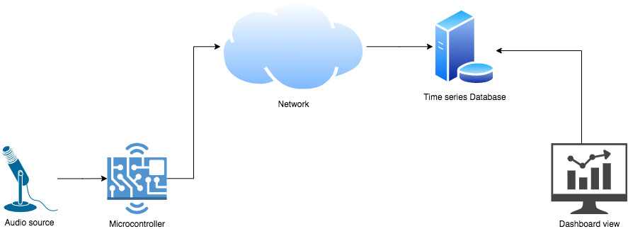
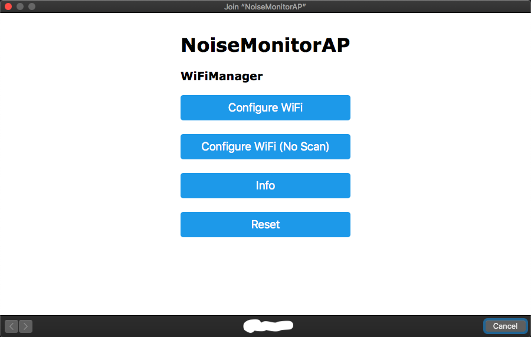
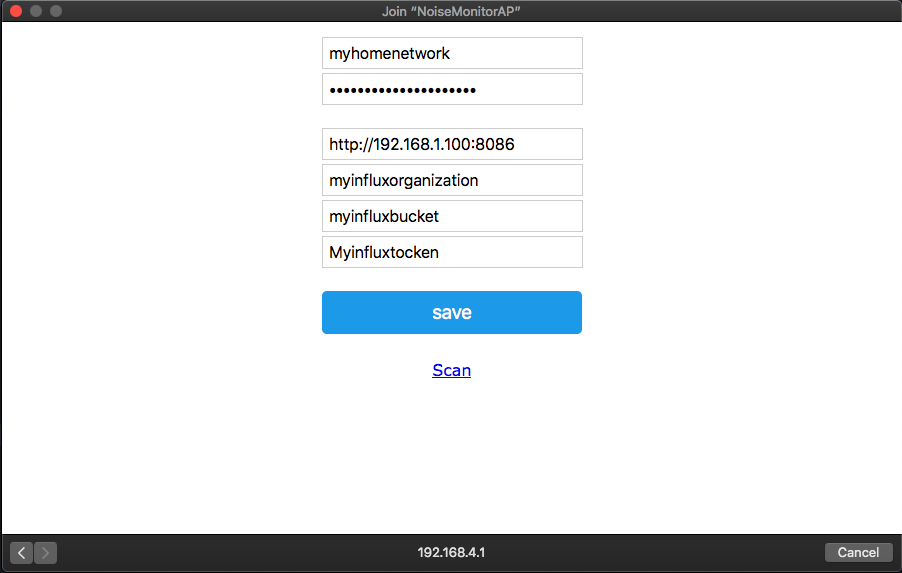
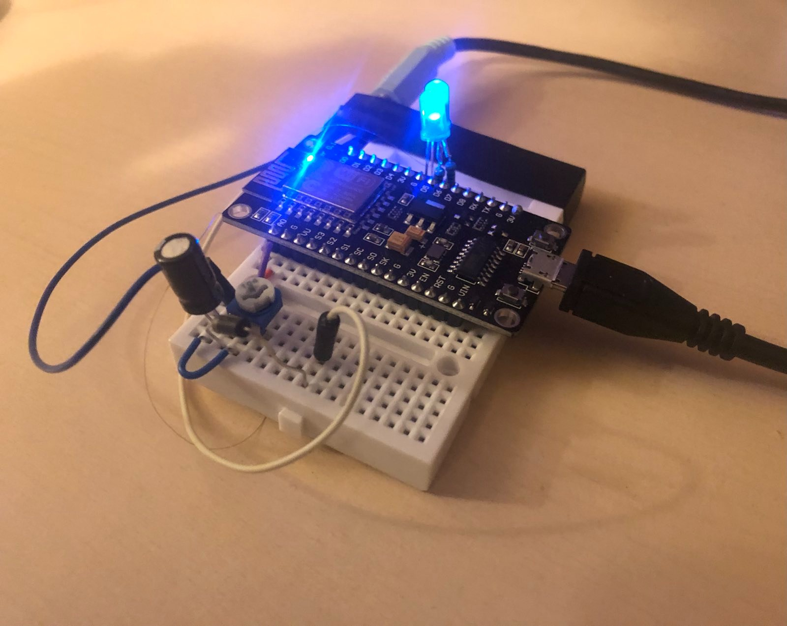

# Noise level monitor using ESP8266 and InfluxDB

For server-side part of this project, see [noise-monitor-infra](https://github.com/mwicat/noise-monitor-infra)

<figure>

<figcaption>High-level architecture</figcaption>
</figure>

## How it works

- Monitors line level audio signal on TRS jack socket
- Transforms audio signal into volume envelope signal with
[Envelope detector circuit](https://en.wikipedia.org/wiki/Envelope_detector)
- [ESP8266 microcontroller](https://en.wikipedia.org/wiki/ESP8266) samples
envelope signal on analog input pin `A0`
- Visualises volume envelope by modulating blue LED brightness with PWM signal
on digital pin `D6`
- Converts amplitude to dB volume and sends to remote InfluxDB service
via Wi-fi connection
- On every successful write to InfluxDB service, the green LED connected to
digital pin `D5` will blink

<figure>

<figcaption>Breadboard project</figcaption>
</figure>

<figure>

<figcaption>Circuit schematic</figcaption>
</figure>

## Usage

1. Deploy attached firmware code to your MCU (project format is PlatformIO).
2. On first run MCU will start wireless access point with SSID 
3. Connect to wireless network `NoiseMonitorAP`. Default password is set
by `AP_PASSWORD` macro to `ohmynoize`
4. [Captive portal](https://en.wikipedia.org/wiki/Captive_portal) should appear
where you can configure credentials for Wi-fi that MCU should ultimately connect
to. Also specify settings for InfluxDB connection. For more details on how this
phase works or how it should work, see [WiFiManager documentation](https://github.com/tzapu/WiFiManager/blob/master/README.md#how-it-works)
5. After MCU successfuly connects to target Wi-fi network, captive portal
should disappear and builtin LED should light up
6. You can now connect audio to TRS socket. You can use headphone output
from your laptop or line out from [preamplifier](https://en.wikipedia.org/wiki/Microphone_preamplifier).
In my case I used line/headphone out from [Tascam DR-22WL
](https://www.tascam.eu/en/dr-22wl) handheld recorder.

<figure>

<figcaption>Captive portal 1st step</figcaption>
</figure>

<figure>

<figcaption>Captive portal 2nd step</figcaption>
</figure>

## Resetting credentials and settings

If you want MCU to forget credentials and settings that you provided and
eventually spawn again wireless AP and enter the settings again, you can
use reset switch which connects D1 pin to ground. Just restart the board and
hold the reset switch (or shorten D1 pin to ground) while it boots. In this
case, firmware should clear its memory.

## In action

<figure>

<figcaption>Simplified realization</figcaption>
</figure>
