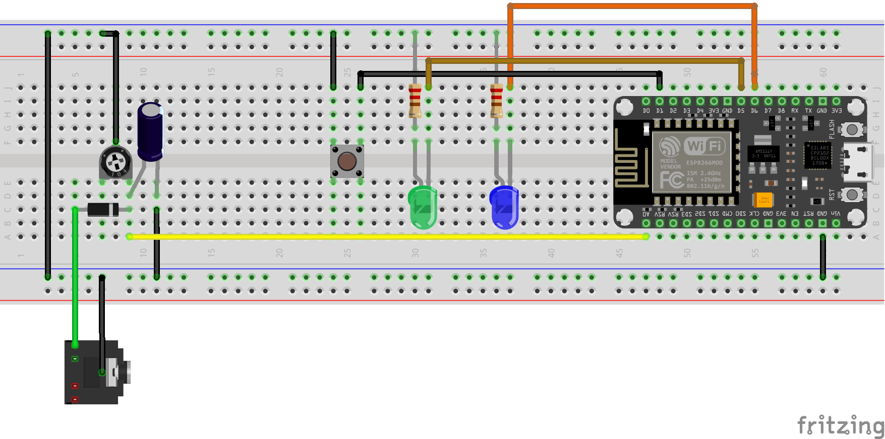
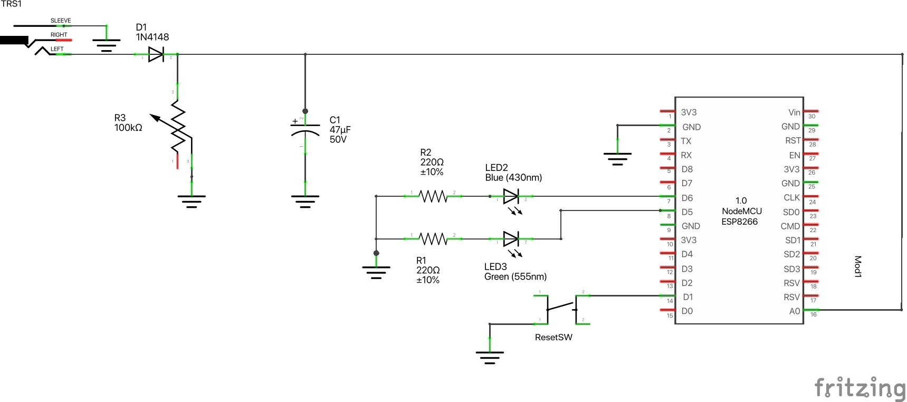

# Noise level monitor using ESP8266 and InfluxDB

## How it works

- Monitors line level audio signal on TRS jack socket
- Transforms audio signal into volume envelope signal with
[Envelope detector circuit](https://en.wikipedia.org/wiki/Envelope_detector)
- [ESP8266 microcontroller](https://en.wikipedia.org/wiki/ESP8266) samples envelope signal on analog input pin A0
- Visualises volume envelope by modulating blue LED brightness with PWM signal
- Converts amplitude to dB volume and sends to remote InfluxDB service
via Wi-fi connection

## Usage

1. Deploy attached firmware code to your MCU (project format is PlatformIO).
2. On first run MCU will start wireless access point with SSID 
3. Connect to wireless network `NoiseMonitorAP`
4. [Captive portal](https://en.wikipedia.org/wiki/Captive_portal) should appear
where you can configure credentials for Wi-fi that MCU should ultimately connect
to. Also specify settings for InfluxDB connection. For more details on how this
phase works or how it should work, see [WiFiManager documentation](https://github.com/tzapu/WiFiManager/blob/master/README.md#how-it-works)

## Resetting credentials and settings

If you want MCU to forget credentials and settings that you provided and
eventually spawn again wireless AP and enter the settings again, you can
use reset switch which connects D1 pin to ground. In this case, firmware
should clear its memory.